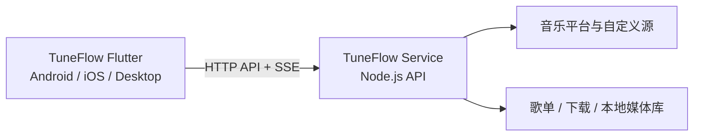

# TuneFlow · 音流（客户端）

本仓库是 TuneFlow（中文名“音流”）的跨平台客户端，使用 Flutter 构建 Android、iOS、macOS、Windows 与 Linux 界面，并连接 [TuneFlow Service + Web](https://github.com/appdev/TuneFlow)。

本仓库只负责客户端交互、状态展示与播放体验；音乐平台数据、歌单、媒体解析、下载、本地媒体库和持久化数据均由 TuneFlow Service 提供与管理。

## 与服务端仓库的关系

| 组成 | GitHub 仓库 | 职责 |
| --- | --- | --- |
| TuneFlow 客户端（本仓库） | [appdev/TuneFlow-Client](https://github.com/appdev/TuneFlow-Client) | 连接 Service、展示统一歌曲列表、搜索与歌单浏览、播放控制、下载管理和客户端交互状态 |
| Service + Web | [appdev/TuneFlow](https://github.com/appdev/TuneFlow) | 聚合音乐平台、统一 API 契约、歌单与媒体库持久化、音频解析与代理、下载任务和事件流 |



两套代码是同一产品的两个独立交付物：

- Flutter 客户端不直接请求酷我、酷狗、QQ、网易云或咪咕等上游平台，也不复制服务端 provider 逻辑。
- Service 将不同平台的数据规范化为统一歌曲、专辑、歌单和排行榜模型，客户端按统一模型渲染。
- Service 是歌单、下载、本地媒体库等持久化数据的唯一所有者；客户端不自行维护第二份业务数据库。
- API 契约发生变化时，应先在 Service 中更新实现与 OpenAPI/测试，再同步客户端 repository、模型与联调测试。
- 两个仓库可以分别构建和发布，但进行真实数据联调时必须同时运行。

## 本地联调

### 1. 启动 TuneFlow Service

```sh
git clone https://github.com/appdev/TuneFlow.git
cd TuneFlow
npm ci
npm run build:service
npm run start:server
```

Service 默认地址为 `http://127.0.0.1:3124`。如需让手机或其他局域网设备访问，可在可信网络中设置 `TUNEFLOW_HOST=0.0.0.0`，并通过系统防火墙限制访问范围。Service 当前不应直接暴露到公网。

### 2. 启动 Flutter 客户端

```sh
git clone https://github.com/appdev/TuneFlow-Client.git
cd TuneFlow-Client
flutter pub get
flutter run -d macos
```

首次启动时在连接页填写 Service 地址：

- macOS、Windows、Linux、iOS 模拟器：`http://127.0.0.1:3124`
- Android 模拟器：`http://10.0.2.2:3124`
- 真机：`http://<运行 Service 的局域网地址>:3124`

客户端连接后会通过 `/api/v1/health` 和 `/api/v1/capabilities` 确认 Service 状态与能力，并通过 `/api/v1/events` 接收事件更新。

## 主要功能

- 多平台歌曲、专辑与歌单搜索
- 真实歌单分类、推荐、详情与分页浏览
- 全局统一的歌曲列表与播放操作
- 排行榜、收藏歌单与试听列表
- 播放、歌词、封面与媒体地址解析
- Service 下载任务和本地媒体库管理
- Android、iOS、macOS、Windows、Linux 自适应界面

## 开发验证

```sh
flutter analyze
flutter test
flutter test test/visual/full_ui_gallery_test.dart
flutter test test/visual/high_fidelity_gallery_test.dart
```

需要连接真实 Service 的集成测试：

```sh
LX_SERVICE_ORIGIN=http://127.0.0.1:3124 \
  flutter test test/integration/real_catalog_sources_test.dart
```

部分真实播放验收还需要按照测试提示提供 `LX_TEST_SOURCE` 和 `LX_TEST_QUERY`。

## 联动开发约定

1. 先确定功能属于客户端表现还是 Service 数据/能力，避免跨仓库重复实现。
2. Service 新增或修改接口时，在 [TuneFlow](https://github.com/appdev/TuneFlow) 仓库完成接口测试和服务端构建。
3. Flutter 侧使用 `lib/features/**/**_repository.dart` 封装接口调用，并保持页面只消费统一领域模型。
4. 涉及搜索、排行榜、歌单详情等歌曲列表的改动，应同步验证共享列表组件及其视觉基线。
5. 联调完成后分别提交到各自仓库，并在提交或 PR 中引用另一端的关联变更。

## 安全与版权

TuneFlow 用于技术学习与自托管场景。在线数据来自对应平台或用户配置的自定义源，项目不保证第三方数据和媒体链接的合法性、准确性或可用性。请遵守所在地法律法规，尊重音乐版权，并避免将无认证的 Service 暴露到公网。
