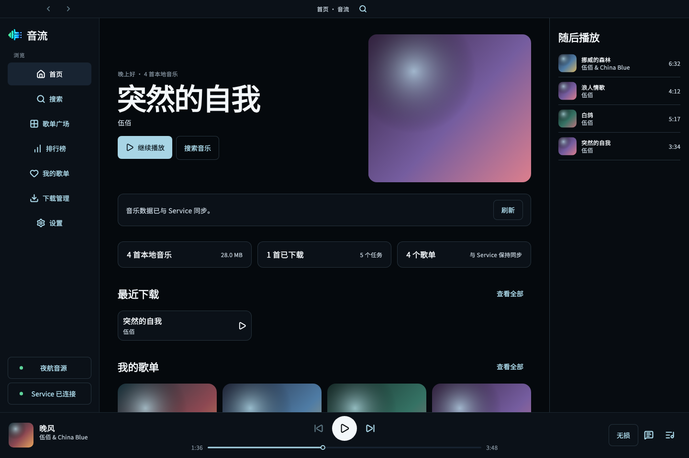
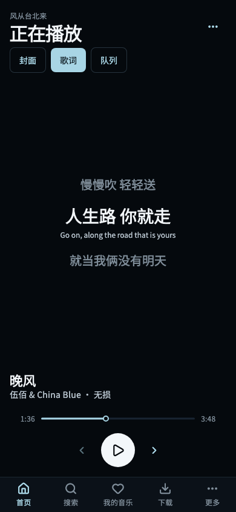
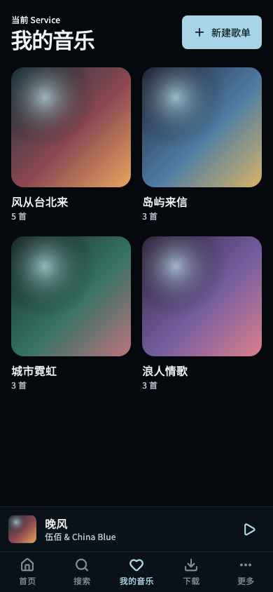

<!-- Hallmark · genre: atmospheric · macrostructure: Workbench -->
<!-- Hallmark · pre-emit critique: P4 H5 E4 S5 R5 V4 -->

  

<h1 align="center">TuneFlow · 音流</h1>

把喜欢的音乐，安静地留在自己的节奏里。

  <a href="https://github.com/appdev/TuneFlow-Client/actions/workflows/build-clients.yml">获取最新构建</a>
  ·
  <a href="https://github.com/appdev/TuneFlow">TuneFlow Service</a>

TuneFlow 是一款面向桌面与移动设备的音乐客户端。它把发现、收藏、歌单与播放放进一个简洁的空间里，让听音乐这件事轻松一点。

## 为每天的音乐而设计

### 找到想听的

从熟悉的歌曲出发，也给偶然遇见的旋律留一点位置。搜索、推荐与歌单自然地聚在一起，不需要来回切换心情。

### 把喜欢的留在身边

收藏、试听列表与自己的歌单集中整理。无论从哪里开始，都可以用同一种方式查看和播放。

### 专心听这一首

清晰的封面、歌词与播放控制留在手边，其余内容安静退后。想沉浸时，界面不会打扰。

## 随身，也自在

  
  

TuneFlow 会顺着不同屏幕调整布局。桌面上适合慢慢整理，手机上则把播放与常用歌单放得更近。

## 获取 TuneFlow

TuneFlow 仍在持续开发中。可以前往 [GitHub Actions 构建页面](https://github.com/appdev/TuneFlow-Client/actions/workflows/build-clients.yml)，打开最近一次成功构建，在页面底部下载适合设备的文件。下载构建产物可能需要登录 GitHub。

| 设备 | 当前提供的文件 |
| --- | --- |
| Android | 已签名 APK |
| iPhone / iPad | 未签名的开发构建，需要自行签名 |
| macOS | 未签名的开发构建，首次打开可能需要在系统中确认 |
| Windows | ZIP 压缩包 |
| Linux | TAR.GZ 压缩包 |

## 与 TuneFlow Service 一起使用

TuneFlow 客户端需要连接 [TuneFlow Service](https://github.com/appdev/TuneFlow) 才能使用在线搜索、歌单与播放等功能。客户端与 Service 都是公开项目，可以按自己的设备与使用方式进行部署。

客户端源码位于 [appdev/TuneFlow-Client](https://github.com/appdev/TuneFlow-Client)。

## 版权与使用说明

TuneFlow 用于个人学习与自托管场景。客户端不提供音乐内容，在线内容的可用性由所连接的 Service 及其数据来源决定。请遵守所在地法律法规，尊重音乐版权，并妥善保护自己的服务地址与数据。
